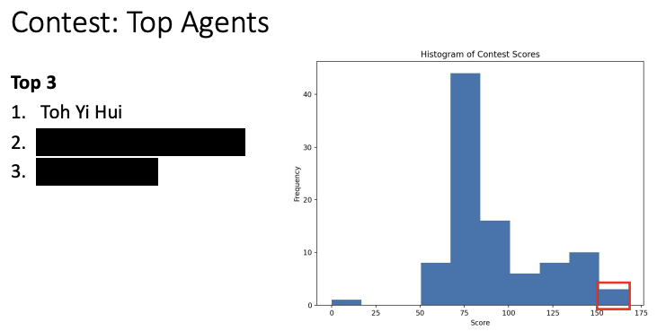

# UltimateTTT

This project was my winning entry among over 200 students in a mini contest during the CS2109S course (Academic Year 2425 Semester 2), where students built AI agents to compete in Ultimate Tic Tac Toe.



## Overview

My agent uses a **Minimax search with iterative deepening** combined with a learned heuristic to evaluate board states efficiently under strict time constraints (3 seconds per move). The core challenge was to balance computational cost with predictive accuracy to select the best move.

## Strategy

- **Minimax with Iterative Depth Search:**  
  The agent performs iterative deepening minimax search, increasing depth until the 3-second move time limit is reached, guided by a heuristic evaluation to prune and evaluate game states.

- **Heuristic Model:**  
  Instead of a monolithic neural net, I designed a hierarchical model that predicts the status of each of the 9 local boards individually, then aggregates these to estimate the global board outcome. This reduces the number of trainable parameters and computational overhead, allowing deeper and faster search within the time limit.

## Data Preparation

- The provided dataset contains board states annotated with `fill_num` to indicate the next player to move.

- To reduce model complexity and improve generalization, I **standardized all board states to assume player 1’s turn by inverting boards where `fill_num` = 2** (switching player 1 and player 2 markers).

- To augment data, I used **rotations and flips** of each board state to increase dataset size and variability.

## Feature Extraction

The Ultimate Tic Tac Toe board is split into its 9 local boards. For each local board, I extract 13 features representing its status:

- Whether the local board is actionable based on the previous move and local board statuses.
- One-hot encoding of the local board’s status (e.g., won by player 1, player 2, draw).
- The state of each of the 9 cells encoded as:
  - `0` = empty
  - `1` = player 1’s mark
  - `-1` = player 2’s mark (after inversion if needed)

This representation captures the global-to-local relationship needed to predict both local and global board statuses.

**Excerpt of the feature extraction logic:**

```python
def extract_features(self, state: State):
    if state.fill_num == 2:
        state = self._inverse_state(state)
    status = state.local_board_status
    features = []
    for x in range(3):
        for y in range(3):
            board = state.board[x, y]
            get_value = [0, 1, -1]
            features.append([
                self._check_actionable(state.prev_local_action, status, x, y),
                1 if status[x, y] == 1 else 0,
                1 if status[x, y] == 2 else 0,
                1 if status[x, y] == 3 else 0,
                get_value[board[0, 0]],
                # ... all 9 cells ...
            ])
    return features
```

## Model Architecture and Training

The model consists of two parts:

- **LocalNN:** a small neural network that predicts the status of each local board from its 13 features.

- A second network that takes the 9 local board status outputs and predicts a global board evaluation (final heuristic value).

The design reuses the LocalNN weights for all 9 local boards, reducing the number of parameters and computational load.

The output uses `tanh` activation to produce values between -1 and 1, corresponding to the expected game outcome from player 1’s perspective.

**Model definition snippet:**

```python
class Heuristic(nn.Module):
    class LocalNN(nn.Module):
        def __init__(self):
            super().__init__()
            self.fc1 = nn.Linear(13, 32)
            self.fc2 = nn.Linear(32, 32)
            self.fc3 = nn.Linear(32, 32)
            self.fc4 = nn.Linear(32, 1)
        
        def forward(self, x):
            x = F.gelu(self.fc1(x))
            x = F.gelu(self.fc2(x))
            x = F.gelu(self.fc3(x))
            return torch.tanh(self.fc4(x))

    def __init__(self):
        super().__init__()
        self.localNN = Heuristic.LocalNN()
        self.fc1 = nn.Linear(9, 32)
        self.fc2 = nn.Linear(32, 32)
        self.fc3 = nn.Linear(32, 32)
        self.fc4 = nn.Linear(32, 1)

    def forward(self, x):
        x = self.localNN(x)  # predict each local board status
        x = F.gelu(self.fc1(x.squeeze(-1)))
        x = F.gelu(self.fc2(x))
        x = F.gelu(self.fc3(x))
        return torch.tanh(self.fc4(x))
```

## Usage Instructions

- **`mini-project.ipynb`** — Overview of the game rules and basic exploration.
- **`utils.py`** — Common utility functions for editing and manipulating board states.
- **`data.pkl`** — The original dataset provided by the CS2109S team.
- **`data.py`** — Script to augment the dataset by applying rotations and flips to generate more training examples.
- **`training.ipynb`** — Notebook showing the model training process after data augmentation.
- **`baseline.py`** — A simple baseline DNN model that flattens the entire board state into 132 features and trains on that.
- **`student.py`** — The code for my winning submission implementing the described heuristic and minimax strategy.

## Results

- The approach enabled efficient evaluation of complex board states within the 3-second move limit.
- Won first place out of over 200 competitors in the CS2109S Ultimate Tic Tac Toe mini contest.
- The modular and parameter-efficient model facilitated faster training and inference during competition.

## Acknowledgements

Special thanks to the **CS2109S AY2425 Semester 2 team** for organizing this enriching contest and providing the platform to develop and compete with Ultimate Tic Tac Toe agents.
